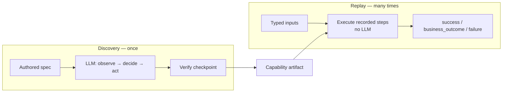
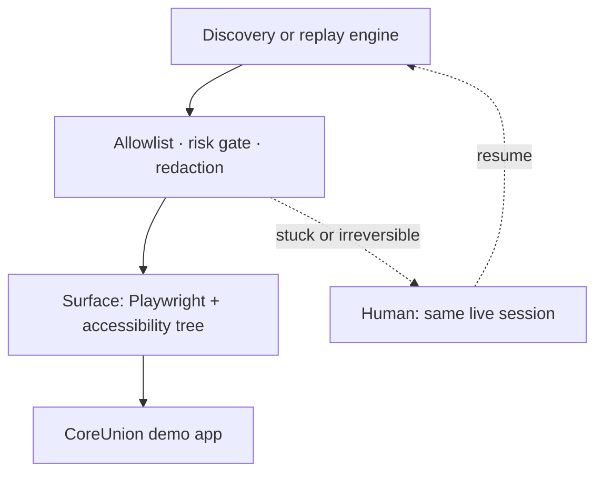

# REPORT

The model discovers how to drive a back-office screen **once**. The successful
run becomes a typed capability. Production invocation is **deterministic replay
of that artifact — no model in the loop.**

How to run: `README.md`. Saved runs: `/evidence/` (index in `evidence/README.md`).

**Built:** two capabilities on a local CoreUnion servicing terminal (legacy
table layout, no test IDs). `member-balance-lookup` (“look up member 12345 and
read savings”) recorded with live Gemini 3.5 Flash.
`open-sub-account` (confirmation screen) recorded with the same discovery loop
via the mock planner. Westside tenant (`/?tenant=westside`) reuses the lookup
artifact through a sparse override. Stack: TypeScript, Playwright, Zod. Tests:
`npm test` (typecheck, policy/redaction checks, five replay cases + navigation
guard + live handoff).

## 1. Architecture

Two paths, one process, one contract. No queues or tenant platform — that is
the infrastructure the brief does not reward.

`--tenant westside` patches the artifact, then the same replay path runs.

### Key decisions and trade-offs

#### Own the loop; no computer-use SDK

- **Decision:** `src/discovery.ts` and `src/replay.ts` are separate. Replay
does not import a model.
- **Why:** An SDK bundles perception, decision, and action. Replay must be
*unable* to reach an LLM.
- **Trade-off:** More glue. Benefit: the production path has no LLM import.

#### Accessibility tree + ranked locators

- **Decision:** Observe the a11y tree. Prefer role / label / placeholder;
CSS / XPath are fallbacks.
- **Why:** No test IDs, table layout, unlabelled values. Role/label is what an
operator sees, and it exists on web and desktop.
- **Trade-off:** Some values have no accessible name, so the list includes a
structural locator.

#### Authored contract; discovered procedure

- **Decision:** `capabilities/*.spec.json` declares inputs, outputs,
checkpoint, outcomes. Discovery fills in steps.
- **Why:** A model is good at driving a screen and bad at deciding what a
capability guarantees.
- **Trade-off:** One spec per capability. Deriving the contract from the model
hardcoded one app into the engine.

#### Single process, CLI as the agent surface

- **Decision:** `discover` / `invoke` / `operator` in one process.
- **Why:** Enough to prove the contract. An HTTP API would not change it.
- **Trade-off:** Reviewers run a CLI, not a service.

## 2. Artifact schema

`schemaVersion: 2.0.0` — a **callable capability**, not a macro. Examples:
`artifacts/member-balance-lookup.v1.json`, `artifacts/open-sub-account.v1.json`.

- `capability` — id, name, revision, `draft | approved`.
- `target` — `surface`, `appId`, `appVersion`, `tenantId`, entry URL,
allowlists (product vs institution).
- `inputs` **/** `outputs` — typed; `sensitive`, optional `pattern`. Lookup:
`memberId` → `savingsBalance`. Sub-account: member + product + amount →
`confirmationNumber`.
- `successCheckpoint` — lookup: `Result Code:`; sub-account:
`Confirmation Number`. Independent of “the model said finish”.
- `outcomes[]` — `business | recoverable | hard` with detect + recovery.
- `steps[]` — action, ranked `target {primary, fallbacks, robustness}`,
`{{param}}` templates, recorded risk.
- `provenance` — audit only.

One selector gives replay nothing when it breaks. Fallback wins emit
`locator_fallback_used`. Outcomes live in the artifact so “not found” is a
product decision. `CapabilityOverride` patches by stable step id (Westside:
Continue + Search → Find Member).

## 3. Determinism & error handling

- No model on replay. Steps in order. Locators: primary then fallbacks.
Bounded waits. Inputs validated **before** the browser opens. Checkpoint
verified on the live page.
- **Classify the screen before treating an exception as a failure.** A missing
cell after “not found” is the answer, not a crash.

| Kind        | Status             | Demo                                                                       |
| ----------- | ------------------ | -------------------------------------------------------------------------- |
| Business    | `business_outcome` | `9999` `MEMBER_NOT_FOUND`; bogus product `VALIDATION_ERROR`                |
| Recoverable | `success`          | `7007` dismiss dialog; `6006` wait/retry                                   |
| Hard        | `failure`          | `4004` permission; `5005` session; `8008` app error; `abc` `input_invalid` |

Failures carry `stepId`, intent, expected, observed, `conditionCode`.
Recoveries are logged even on success.

UI drift is secondary: ranked locators absorb relabels; the checkpoint catches
the wrong screen; persistent fallback use is a drift signal, not a reason to
put the model back in the loop.

## 4. Heterogeneity & multi-tenant

A step says “click *Search* by role+name,” never `#searchBtn`. Replay depends
only on `Surface` (`observe`, `click`, `type`, `waitForText`, `readText`,
snapshots, `takeoverEndpoint`).

- **Web (built):** Playwright.
- **Legacy web:** ranking shifts toward names; schema/replay unchanged.
- **Desktop (seam only):** UIAutomation / Java Access Bridge; CSS/XPath fall
off the list.
- **Screenshot+coordinates:** last-resort strategy in the same list.

**Tenancy:** `appId`+`appVersion` = vendor product; `tenantId` = institution.
Resolution: `base → sparse override`. Westside is the stand-in.
`npm run invoke -- --capability member-balance-lookup --tenant westside --inputs "memberId=12345"`.
One tenant, not hundreds — the merge model is what would scale.

## 5. Escalation & handoff

**Stuck:** same discovery decision ×3; hard outcome with `escalate: true`;
irreversible step awaiting confirm.

**Request:** capability, goal, reason, `conditionCode`, step, URL, screenshot,
DOM + a11y snapshots, takeover endpoint, `access.actionable` (false if
headless with no CDP port). Control is `automation | human`.

**Takeover:** `--takeoverPort` exposes CDP. Operator attaches to **that**
browser: `npm run operator -- --resolve … --click "Login as Teller"`. TTY
prompts write the same `resolution.json`. Evidence:
`evidence/handoff-session-expired-5005/` (member `5005`, operator `teller04`,
resume, success `$2,145.60`). Operator UI is CLI; the transfer is real.

**Hand back:** resume retries the paused step; unchanged condition is
reported; abort ends with the operator on record.

## 6. Safety

**Allowlist.** Protocol, domain, **route prefix**, action types — on entry,
every `goto`, and **after every click/type** via `currentUrl()`. Off-allowlist
**hosts are aborted in Playwright before the document loads** (a button that
redirects to `evil.example.com` never leaves localhost; integration proves
this). Path prefixes on the same host are checked after the action. Guardrails
stay in force for the whole session, not only the entry URL.

**Risk.** `safe` proceeds. `risky` (type, submit) is flagged.
`irreversible` (transfer, delete, disburse) defaults to **human confirm**.
Vocabulary matching is a heuristic; pin the set per app at review.

**Redaction.** Every persisted event goes through `Redactor`: secret keys,
SSN/card/email shapes, literals declared `sensitive`. Locators built from
record data are stripped (a live Gemini run emitted `text="$4,230.91"`).
Evidence logs show `savingsBalance=[REDACTED]`.

**Screenshots.** DOM/a11y snapshots are scrubbed; **PNG pixels are not.**
Demo data is synthetic, so the public repo is not a PII leak. In a real bank
this evidence class needs restricted/encrypted storage, retention limits, or
image redaction — not ordinary git artifacts. That is an acknowledged limit,
not a scrubbing claim.

## 7. Cuts

### **Deliberately left out**

- Operator console is CLI + JSON, not co-browsing.
- No desktop `Surface` implementation.
- Drift signals are emitted (`locator_fallback_used`), not aggregated.
- `draft | approved` is recorded, not gated on unattended replay.
- No queues, clusters, or multi-tenant platform.
- Stretch taken: invoke-by-name, one cross-tenant override.
- Stretch not taken: codegen, confidence scoring, LLM step-repair, N-run flakiness.

### **What I would build next**

1. Approval gating so `draft` cannot run unattended.
2. Drift aggregation feeding selective re-recording.
3. A second `Surface` to test the abstraction.
4. Bounded, policy-checked single-step assisted recovery — still without putting the model back in the production loop.

