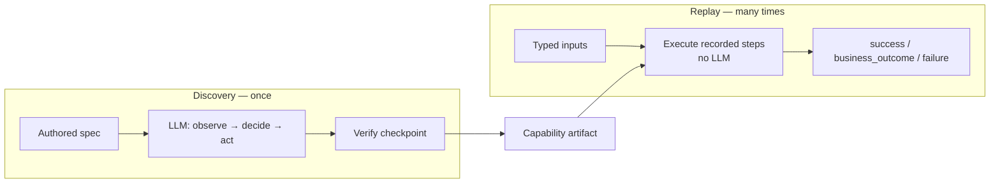
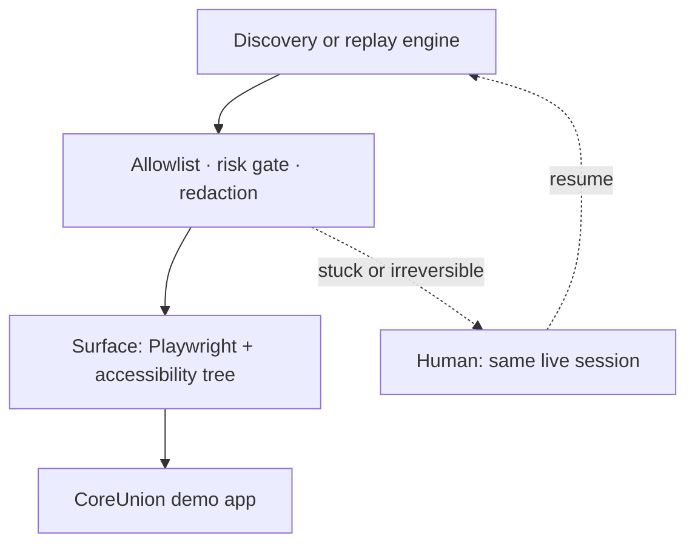

# REPORT

The model discovers how to drive a back-office screen **once**. The successful
run is saved as a typed capability. Production invocation is **deterministic
replay of that artifact — no model in the loop.**

- Discovery is expensive and needs judgement.
- Replay must be cheap, repeatable, and auditable.
- Those are different execution modes; the artifact is the contract between them.

This write-up is self-contained. How to run the repo is in `README.md`. Saved
runs live under `/evidence/`.

### What was implemented

A small end-to-end system for US bank / credit-union **back-office** apps: stable
UIs, real runtime errors, no API, and many tenants on the same vendor product.

- **Discovery:** an LLM (or a mock planner with the same loop) observes the
accessibility tree, decides one action, acts through Playwright, and records
an artifact only if the success checkpoint holds on the live page.
- **Replay / invoke:** the same steps run with **no model**. Typed inputs in;
typed outputs or a classified outcome out.
- **Two capabilities** matching the brief’s examples:
  - `member-balance-lookup` — “look up member 12345 and read their current
  savings balance.” Recorded with live **Gemini 3.5 Flash**.
  - `open-sub-account` — “open a new sub-account for this member and reach the
  confirmation screen.” Recorded with the mock planner (same loop shape).
- **Demo app:** local CoreUnion servicing terminal at `http://localhost:3000`
(`npm run demo-app`). Table layout, no test IDs, unlabelled value spans.
Login as Teller / Supervisor / Sign out. Westside tenant at
`/?tenant=westside` (compliance interstitial + “Find Member”).
- **Safety:** protocol / domain / route allowlist; `safe | risky | irreversible`
with human confirm on irreversible; redaction by construction.
- **Handoff:** pause the live Chromium session, operator attaches over CDP,
resume and retry the paused step.
- **Multi-tenant:** base artifact + sparse override for Westside; no re-record.

Stack: TypeScript, Node, Playwright, Zod. CLI commands: `discover`, `invoke`,
`replay`, `capabilities`, `operator`. Tests: `npm test` (typecheck + policy /
redaction / override checks).

### Demo records:

| ID / input                                    | What the app does                            | Replay result                                            |
| --------------------------------------------- | -------------------------------------------- | -------------------------------------------------------- |
| `12345`                                       | Jordan Hale, savings `$18,640.55`            | `success`                                                |
| `2002`                                        | Noah Davis — different member, same artifact | `success`                                                |
| `9999`                                        | No such member                               | `business_outcome` / `MEMBER_NOT_FOUND`                  |
| `abc`                                         | Non-numeric ID                               | `failure` / `input_invalid` (before the browser)         |
| `4004`                                        | Restricted; teller cannot view               | `failure` / `PERMISSION_DENIED` (supervisor can resolve) |
| `5005`                                        | Session expires once                         | escalates `SESSION_EXPIRED`; resume after sign-in        |
| `6006`                                        | Slow load                                    | `success` after wait / retry                             |
| `7007`                                        | Unexpected review dialog                     | `success`, recovered `UNEXPECTED_DIALOG`                 |
| `8008`                                        | App error                                    | `failure` / `APP_ERROR`                                  |
| Sub-account `12345` + Money Market + `250.00` | Confirmation screen                          | `success` + `confirmationNumber`                         |
| Sub-account bogus product                     | Validation                                   | `business_outcome` / `VALIDATION_ERROR`                  |
| Sub-account `9009` (closed)                   | Denied                                       | `failure` / `PERMISSION_DENIED`                          |
| `--tenant westside`                           | Extra Continue + Find Member                 | `success` on the **same** lookup artifact                |

### Where to look in the repo

| Path                                                    | What it is                                       |
| ------------------------------------------------------- | ------------------------------------------------ |
| `src/discovery.ts`                                      | LLM observe → decide → act                       |
| `src/replay.ts`                                         | Deterministic executor (no LLM)                  |
| `src/types.ts`                                          | Artifact / spec / result schemas (`2.0.0`)       |
| `src/surface.ts`, `src/browser-surface.ts`              | Perception / action seam                         |
| `src/policy.ts`, `src/risk-gate.ts`, `src/redaction.ts` | Guardrails                                       |
| `src/escalation.ts`, `src/session-control.ts`           | Live-session handoff                             |
| `src/overrides.ts`                                      | Tenant patches                                   |
| `src/demo-app/`                                         | Target UI                                        |
| `capabilities/*.spec.json`                              | Authored contracts                               |
| `artifacts/*.json`                                      | Recorded capabilities                            |
| `evidence/`                                             | Discovery + replay logs (see end of this report) |

## 1. Architecture

Two paths, one process, one contract. No queues, clusters, or tenant services —
the brief does not reward that infrastructure, and building it would hide the
load-bearing pieces.

### Shape

Two execution paths, joined only by the artifact:

Both paths share the same runtime underneath, in a straight line:

A tenant override is not a second flow: `--tenant westside` patches the base
artifact, then replay runs as above.

### Key decisions and trade-offs

#### Own the loop; do not use a computer-use SDK

- **Decision:** Discovery (`src/discovery.ts`) and replay (`src/replay.ts`) are
separate modules. Replay does not import or construct a model.
- **Why:** SDKs bundle perception, decision, and action. Production replay must
be *unable* to reach an LLM, not merely documented as unused.
- **Trade-off:** More glue than wrapping an agent SDK. Benefit: the production
path has no LLM import.

#### Perceive through the accessibility tree; act through ranked locators

- **Decision:** Observation is the accessibility tree. Locators prefer
role / label / placeholder; CSS and XPath are fallbacks only.
- **Why:** The demo (and the real environment) has no test IDs, table layout,
and unlabelled value spans. Role and label describe what an operator sees.
The same channel exists on web, framesets, and desktop.
- **Trade-off:** Some values have no accessible name (a balance cell still
needs a structural locator). That is why identification is a ranked list,
not a single selector.

#### The contract is authored; only the procedure is discovered

- **Decision:** `capabilities/*.spec.json` declares inputs, outputs, checkpoint,
and outcomes. Discovery fills in steps.
- **Why:** A model is good at driving a screen and bad at deciding what a
capability *guarantees* to callers. Guarantees are product decisions.
- **Trade-off:** One spec file per capability. Deriving the contract from the
model previously hardcoded one app into the engine, so it could only ever
record a single flow.

#### Single process, CLI as the agent surface

- **Decision:** `discover`, `invoke`, and `operator` are CLI commands in one
process. A calling agent invokes by capability name (`npm run invoke -- --capability member-balance-lookup --inputs "memberId=12345"`).
- **Why:** That is enough to prove the contract. Queues, clusters, and an HTTP
API would not change the design and are the infrastructure the brief does
not reward.
- **Trade-off:** Reviewers run a CLI, not a service. Same artifact, smaller
surface.

### Target

- Local CoreUnion member-servicing terminal (legacy-flavoured web).
- Two capabilities from the brief, as listed above.
- Two tenants of the same vendor product (`/` vs `/?tenant=westside`).

## 2. Artifact schema

`schemaVersion: 2.0.0`. Shaped as a **callable capability**, not a recorded
macro. A calling agent should answer “what does this do, what does it need,
what do I get back, what can go wrong?” without reading the steps.

Example artifacts: `artifacts/member-balance-lookup.v1.json` (Gemini) and
`artifacts/open-sub-account.v1.json` (mock planner). Copies under `evidence/`.

### Fields and why they exist

- `capability` — stable id, name, revision, `draft | approved`.
- `target` — `surface`, `appId`, `appVersion`, `tenantId`, entry URL,
allowlists. Product vs institution.
- `inputs` **/** `outputs` — typed; `sensitive` and optional `pattern`.
Lookup: `memberId` in, `savingsBalance` out (sensitive). Sub-account:
`memberId`, `productType`, `openingAmount` in; `confirmationNumber` out.
- `successCheckpoint` — lookup: text `Result Code:`; sub-account: text
`Confirmation Number`. Independent of “the model said finish”.
- `outcomes[]` — `business | recoverable | hard`, with detect and optional
recovery (`MEMBER_NOT_FOUND`, `VALIDATION_ERROR`, `PERMISSION_DENIED`,
`SESSION_EXPIRED`, `APP_ERROR`, `UNEXPECTED_DIALOG`, `TRANSIENT_LOAD_FAILURE`).
- `steps[]` — action, ranked `target`, `valueTemplate` (e.g. `{{memberId}}`),
recorded risk.
- `provenance` — goal, model, discovery run. Audit trail, not replay input.

### How identification is shaped

- A ranked candidate list: `primary` + `fallbacks` + `robustness`.
- Role / label / placeholder rank above CSS / XPath.
- One selector gives replay nothing when it breaks and gives operators no
drift signal.
- A fallback that wins emits `locator_fallback_used`.

### How reuse is shaped

- `{{param}}` **templates** keep record IDs out of the stored flow, so the
same artifact looks up `12345` or `2002`.
- **Outcomes live in the artifact**, so “MEMBER_NOT_FOUND is a business
answer” is a product decision, not engine logic.
- `CapabilityOverride` (`capabilities/overrides/westside.member-balance-lookup.json`)
inserts a Continue click and patches Search → Find Member by stable step id.

## 3. Determinism & error handling

### How replay stays deterministic

- Replay never constructs a model (`src/replay.ts` has no LLM import).
`USE_MOCK_LLM` is ignored on invoke and prints a note saying so.
- Steps run in recorded order.
- Locators try primary, then fallbacks.
- Waits are bounded.
- Inputs are validated (required, type, pattern) **before** the browser opens.
- The checkpoint is verified on the live page before `success`.

### How runtime errors are classified

The load-bearing rule: **classify the screen before treating an exception as a
failure.** A missing balance cell after a not-found result is not a crash; it
is the answer. That is how a happy-path-only capability is avoided.

- **Business** → status `business_outcome`
  - Legitimate domain answer.
  - Demo: `9999` → `MEMBER_NOT_FOUND`; bogus product → `VALIDATION_ERROR`.
- **Recoverable** → status `success` (or `recoverable_exhausted`)
  - Defined remedy, then continue (`dismiss_dialog`, `wait_and_retry`,
  `reload_and_retry`).
  - Demo: `7007` dismiss dialog; `6006` wait / retry slow load.
- **Hard** → status `failure`
  - Stop with step context (`stepId`, intent, expected, observed,
  `conditionCode`).
  - Demo: `4004` permission; `5005` session; `8008` app error; `abc` →
  `input_invalid`.

Recoveries are reported even on success: “worked after a dialog” is
operationally different from a clean run.

### UI drift (secondary)

- Ranked locators absorb small relabels.
- The checkpoint catches a run that clicked through to the wrong screen.
- Persistent fallback use is a leading indicator of a vendor change, not a
reason to put the model back in the loop.

## 4. Heterogeneity & multi-tenant

### Heterogeneous surfaces

A recorded step says “click *Search*, primarily by role + name,” never
“dispatch a DOM click on `#searchBtn`.”

- The seam is `Surface`: `observe`, `click`, `type`, `waitForText`, `readText`,
snapshots, `takeoverEndpoint`.
- Replay depends only on that interface.
- **Web (built):** Playwright adapter.
- **Legacy web:** frames / nested tables; ranking shifts toward names.
Schema, replay, taxonomy, and evidence do not change.
- **Desktop (designed, not built):** UIAutomation / Java Access Bridge;
CSS / XPath fall off the ranked list; role / name map almost directly.
- **Screenshot + coordinates:** last-resort strategy in the same ranked list.
- Only web is implemented. The interface is the claim; a second adapter would
be the proof. That is an intentional cut, not an assumption that every app
is a clean DOM.

### Multi-tenant reuse

- Hundreds of institutions run the same vendor product, configured differently.
- `appId` + `appVersion` name the product; `tenantId` names the institution.
- Invoke resolution: `base artifact → sparse override`.
- Westside Credit Union is the stand-in: same CoreUnion app, compliance
interstitial, Search relabelled “Find Member.”
- `npm run invoke -- --capability member-balance-lookup --tenant westside --inputs "memberId=12345"`
reuses the Gemini recording (`savingsBalance` `$18,640.55`).
- A fix to the base flow reaches Westside without re-recording.
- One tenant, not hundreds: the resolution model is what would scale;
building a tenant service would not.

## 5. Escalation & handoff

### How “stuck” is detected

- Discovery repeating the same decision three times.
- A hard outcome with `escalate: true` (permission, session expiry, app error).
- An irreversible step awaiting confirmation.

### What the intervention carries

- Capability, goal, reason, `conditionCode`.
- Step id and intent, URL.
- Screenshot, DOM snapshot, accessibility snapshot.
- Takeover endpoint.
- `access.actionable` — false if the session is headless with no CDP port
(so we do not pretend the operator can click).
- Control ownership is explicit (`automation | human`). Automation cannot act
while a human holds the session.

### How a human takes control of the live session

- With `--takeoverPort`, Chromium exposes CDP.
- A second process attaches to **that** browser, not a new one:
`npm run operator -- --resolve … --click "Login as Supervisor"`.
- Interactive TTY prompts are the other wait mode; both write the same
`resolution.json`.
- Worked example: member `5005` expires the session; operator clicks
“Login as Teller”; automation retries and completes.
- Operator UI is a CLI (in scope). The transfer model is real: pause, same
session, act, resume.

### How control is handed back

- On `resume`, automation retries the paused step.
- If the condition is unchanged, the failure says it survived the handoff.
- On `abort`, the run ends with the operator on record.
- Before / after snapshots and the URL delta are persisted.

## 6. Safety

### Allowlist

- Protocol, domain, and **route prefix**, plus permitted action types.
- Enforced on entry and every `goto`.
- Domain-only allowlisting is too coarse: the same host often serves servicing
and admin.
- Default: `localhost` / `127.0.0.1` only.

### Risk tiers

- `safe` — proceeds.
- `risky` (type, submit, open new) — proceeds and is flagged.
- `irreversible` (transfer, delete, disburse, close account) — defaults
to **human confirm**.
- Blocking that class makes needed capabilities unautomatable; only flagging
lets money move unattended.
- Classification is vocabulary on the control label (a heuristic). Production
should pin the irreversible set per app at review time.

### Redaction

- Enforced by construction: every persisted event goes through `Redactor`
inside `RunLogger`.
- Secret keys, SSN / card / email shapes, and **literals declared** `sensitive`
(so `$18,640.55` is scrubbed from DOM dumps that have no field names).
- Discovery parameterizes typed values and **strips locators built from
record data**.
- A live Gemini run emitted `text="$4,230.91"` as a fallback — that both leaks
a balance and only matches one member. Enforcement is at the persist
boundary, not in the prompt. Evidence logs show `savingsBalance=[REDACTED]`.

### Limits

- Screenshots still show the screen (access-control, not scrubbing).
- Condition detection is text / dialog matching.
- Risk matching is vocabulary.

## 7. Cuts

### Deliberately left out

- Operator console is CLI + JSON, not co-browsing.
- No desktop `Surface` implementation.
- Drift signals are emitted (`locator_fallback_used`), not aggregated.
- `draft | approved` is recorded, not gated on unattended replay.
- No queues, clusters, or multi-tenant platform.
- Stretch taken: invoke-by-name, one cross-tenant override.
- Stretch not taken: codegen, confidence scoring, LLM step-repair, N-run
flakiness.

### What I would build next

1. Approval gating so `draft` cannot run unattended.
2. Drift aggregation feeding selective re-recording.
3. A second `Surface` to test the abstraction.
4. Bounded, policy-checked single-step assisted recovery — still without
  putting the model back in the production loop.

---

## Evidence:

Saved under `/evidence/`. Each run has `events.jsonl`; failures also have
`.aria.txt` and `.html` snapshots.

### Example artifacts

- `evidence/example-artifact.member-balance-lookup.json` — live Gemini 3.5 Flash
(`discovery-2026-08-15T19-56-30-357Z`).
- `evidence/example-artifact.open-sub-account.json` — mock planner
(`discovery-2026-08-16T17-08-41-265Z`). Same loop; no API key needed to
re-record.

One live LLM discovery satisfies the brief. Replay of both capabilities is
deterministic and does not call a model.

### Discovery

- `evidence/discovery-2026-08-15T19-56-30-357Z/` — live Gemini lookup;
model rationales in `events.jsonl`; balance redacted.
- `evidence/discovery-2026-08-16T17-08-41-265Z/` — sub-account through
confirmation.

### Replay (no LLM)

- `replay-2026-08-16T17-08-51-162Z` — lookup `12345` success (`$18,640.55`).
- `replay-2026-08-16T17-08-51-966Z` — lookup `2002` (parameterization).
- `replay-2026-08-16T17-08-52-749Z` — `MEMBER_NOT_FOUND`.
- `replay-2026-08-16T17-08-53-540Z` — `input_invalid`.
- `replay-2026-08-16T17-08-54-050Z` — recovered dialog (`7007`).
- `replay-2026-08-16T17-08-54-859Z` — `PERMISSION_DENIED` (`4004`).
- `replay-2026-08-16T17-08-55-639Z` — `APP_ERROR` (`8008`).
- `replay-2026-08-16T17-08-56-430Z` — sub-account success.
- `replay-2026-08-16T17-08-57-353Z` — sub-account `VALIDATION_ERROR`.
- `replay-2026-08-16T17-09-24-206Z` — closed membership denied (`9009`).
- `replay-2026-08-16T17-09-09-379Z` — Westside tenant override.

